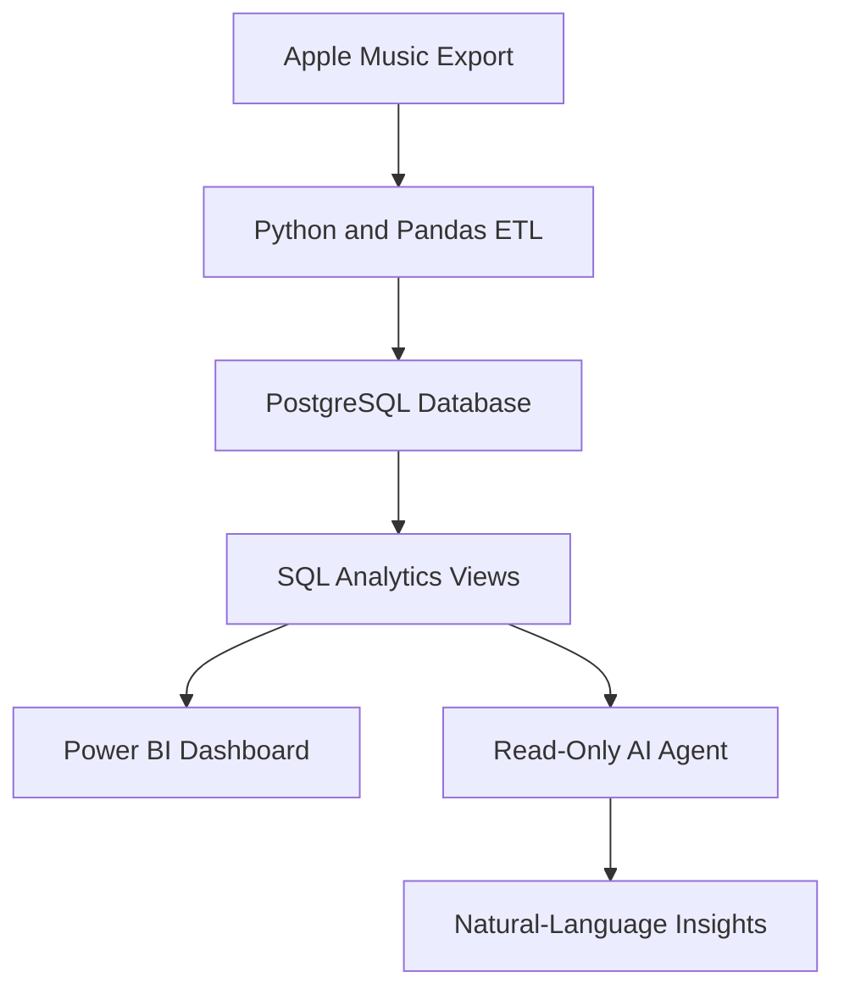

# Music Insights Agent

An agentic analytics system that transforms raw Apple Music listening history into structured data and answers natural-language questions using verified SQL results — not guesses.

## Project Goal

This project combines data engineering, business intelligence, and agentic AI to analyze personal music-listening behavior.

The system answers questions such as:

* Why did my listening change this month?
* Which songs became more popular recently?
* What time of day do I listen to music most?
* How have my skip and completion rates changed?
* Which devices account for most of my listening?

## How It Works: End-to-End Flow

```
Apple Music data
      ↓
Python / Pandas ETL
      ↓
PostgreSQL
      ↓
Analytics tables / views
      ↓
Read-only AI agent
      ↓
Natural-language answers
```

### Worked example: "Why did my listening change this month?"

1. Agent identifies the two periods to compare (this month vs. last month).
2. Agent runs a fixed set of parameterized SQL queries against pre-built analytics views — not freehand queries against raw tables.
3. Metrics compared: total listening minutes, play count, unique artists, unique tracks, genre mix, device breakdown, time-of-day distribution, skip rate, and new-vs-repeated tracks.
4. Agent computes deltas between periods and surfaces the top changes (ranked by magnitude, above a minimum threshold — not every metric that moved).
5. Agent explains the changes in plain language, backed by the actual numbers.

**Important distinction:** the agent can explain *what in the data* changed — e.g. more evening listening, a new favorite artist, a drop in skip rate. It cannot know personal context (e.g. stress, travel, a breakup) unless that information is explicitly provided. This boundary is a deliberate design choice, not a limitation to work around.

## Architecture



## Dataset

The main Apple Music Play Activity export contains:

* 278,231 activity records
* 145 columns
* Playback timestamps
* Song and album information
* Listening duration
* Playback completion and skip information
* Device and playback-source data

Additional Apple Music exports may be used for artist, genre, library, and ranking information.

## Technology Stack

* Python
* Pandas
* PostgreSQL
* SQL
* Power BI
* AI agent with controlled, read-only database access
* Git and GitHub

## Design Principles for the AI Agent

* **Read-only access.** The agent connects through a database role with `SELECT`-only grants — not just a prompt instruction, but an enforced permission boundary.
* **Predefined analytics views, not freehand SQL.** The agent selects from a fixed set of parameterized views (e.g. `monthly_summary(month)`) rather than writing arbitrary queries against raw tables. This keeps answers safe, testable, and reproducible.
* **Numbers before narrative.** Every explanation is grounded in query results. No claim is made without a supporting figure.
* **No causal overreach.** The agent reports data-observable changes only. It does not infer personal motivations or external causes it has no evidence for.

## Planned Features

* Chunked processing for large CSV files
* Data cleaning and validation
* Duplicate-event handling
* Removal of private and unnecessary fields
* PostgreSQL data modeling
* Reusable SQL analytics views
* Interactive Power BI dashboard
* Read-only AI agent that converts questions into safe, pre-scoped SQL queries
* Explanations supported by query results and measurable changes

## Project Status

- [x] GitHub repository created
- [x] Private data protected with `.gitignore`
- [x] Initial source-file inspection
- [x] Project folder structure
- [ ] Python data-profiling pipeline
- [ ] Data cleaning and transformation
- [ ] PostgreSQL database
- [ ] SQL analytics layer
- [ ] Power BI dashboard
- [ ] AI analytics agent
- [ ] Testing and documentation

## Privacy

The original Apple Music ZIP archive and CSV files contain personal information and are never uploaded to GitHub.

This repository contains only:

* Source code
* SQL scripts
* Documentation
* Dashboard screenshots
* Sanitized sample data

## Disclaimer

This is an independent portfolio project and is not affiliated with or endorsed by Apple.